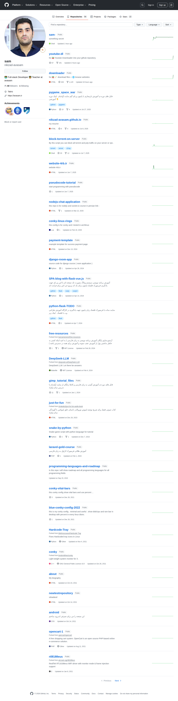

# Visited: https://github.com/nikzad-avasam?tab=repositories
**Time:** Mon May  4 15:01:01 UTC 2026

## Screenshot

## Raw HTML
[page.html](./page.html)

## Downloaded Media (7 files)
## Downloaded Media Files

## Other Links
- [#start-of-content](#start-of-content)
- [/](/)
- [/aircrack-ng/rtl8188eus](/aircrack-ng/rtl8188eus)
- [/barnamenevisi/free-resources](/barnamenevisi/free-resources)
- [/bilelmoussaoui/Hardcode-Tray](/bilelmoussaoui/Hardcode-Tray)
- [/brndnmtthws/conky](/brndnmtthws/conky)
- [/contact/report-abuse?report=nikzad-avasam+%28user%29](/contact/report-abuse?report=nikzad-avasam+%28user%29)
- [/deepseek-ai/DeepSeek-LLM](/deepseek-ai/DeepSeek-LLM)
- [/login?return_to=https%3A%2F%2Fgithub.com%2Fnikzad-avasam%3Ftab%3Drepositories](/login?return_to=https%3A%2F%2Fgithub.com%2Fnikzad-avasam%3Ftab%3Drepositories)
- [/manifest.json](/manifest.json)
- [/mirakabzi/just-for-fun-audio-book](/mirakabzi/just-for-fun-audio-book)
- [/nikzad-avasam](/nikzad-avasam)
- [/nikzad-avasam/DeepSeek-LLM](/nikzad-avasam/DeepSeek-LLM)
- [/nikzad-avasam/DeepSeek-LLM/graphs/participation?h=28&amp;type=sparkline&amp;w=155](/nikzad-avasam/DeepSeek-LLM/graphs/participation?h=28&amp;type=sparkline&amp;w=155)
- [/nikzad-avasam/Hardcode-Tray](/nikzad-avasam/Hardcode-Tray)
- [/nikzad-avasam/Hardcode-Tray/graphs/participation?h=28&amp;type=sparkline&amp;w=155](/nikzad-avasam/Hardcode-Tray/graphs/participation?h=28&amp;type=sparkline&amp;w=155)
- [/nikzad-avasam/SPA-blog-with-flask-vue.js](/nikzad-avasam/SPA-blog-with-flask-vue.js)
- [/nikzad-avasam/SPA-blog-with-flask-vue.js/graphs/participation?h=28&amp;type=sparkline&amp;w=155](/nikzad-avasam/SPA-blog-with-flask-vue.js/graphs/participation?h=28&amp;type=sparkline&amp;w=155)
- [/nikzad-avasam/SPA-blog-with-flask-vue.js/stargazers](/nikzad-avasam/SPA-blog-with-flask-vue.js/stargazers)
- [/nikzad-avasam/about](/nikzad-avasam/about)
- [/nikzad-avasam/about/graphs/participation?h=28&amp;type=sparkline&amp;w=155](/nikzad-avasam/about/graphs/participation?h=28&amp;type=sparkline&amp;w=155)
- [/nikzad-avasam/android](/nikzad-avasam/android)
- [/nikzad-avasam/android/graphs/participation?h=28&amp;type=sparkline&amp;w=155](/nikzad-avasam/android/graphs/participation?h=28&amp;type=sparkline&amp;w=155)
- [/nikzad-avasam/block-torrent-on-server](/nikzad-avasam/block-torrent-on-server)
- [/nikzad-avasam/block-torrent-on-server/forks](/nikzad-avasam/block-torrent-on-server/forks)
- [/nikzad-avasam/block-torrent-on-server/graphs/participation?h=28&amp;type=sparkline&amp;w=155](/nikzad-avasam/block-torrent-on-server/graphs/participation?h=28&amp;type=sparkline&amp;w=155)
- [/nikzad-avasam/block-torrent-on-server/stargazers](/nikzad-avasam/block-torrent-on-server/stargazers)
- [/nikzad-avasam/blue-conky-config-2022](/nikzad-avasam/blue-conky-config-2022)
- [/nikzad-avasam/blue-conky-config-2022/graphs/participation?h=28&amp;type=sparkline&amp;w=155](/nikzad-avasam/blue-conky-config-2022/graphs/participation?h=28&amp;type=sparkline&amp;w=155)
- [/nikzad-avasam/blue-conky-config-2022/stargazers](/nikzad-avasam/blue-conky-config-2022/stargazers)
- [/nikzad-avasam/conky](/nikzad-avasam/conky)
- [/nikzad-avasam/conky-linux-rings](/nikzad-avasam/conky-linux-rings)
- [/nikzad-avasam/conky-linux-rings/graphs/participation?h=28&amp;type=sparkline&amp;w=155](/nikzad-avasam/conky-linux-rings/graphs/participation?h=28&amp;type=sparkline&amp;w=155)
- [/nikzad-avasam/conky-linux-rings/stargazers](/nikzad-avasam/conky-linux-rings/stargazers)
- [/nikzad-avasam/conky-vital-bars](/nikzad-avasam/conky-vital-bars)
- [/nikzad-avasam/conky-vital-bars/graphs/participation?h=28&amp;type=sparkline&amp;w=155](/nikzad-avasam/conky-vital-bars/graphs/participation?h=28&amp;type=sparkline&amp;w=155)
- [/nikzad-avasam/conky-vital-bars/stargazers](/nikzad-avasam/conky-vital-bars/stargazers)
- [/nikzad-avasam/conky/graphs/participation?h=28&amp;type=sparkline&amp;w=155](/nikzad-avasam/conky/graphs/participation?h=28&amp;type=sparkline&amp;w=155)
- [/nikzad-avasam/django-room-app](/nikzad-avasam/django-room-app)
- [/nikzad-avasam/django-room-app/graphs/participation?h=28&amp;type=sparkline&amp;w=155](/nikzad-avasam/django-room-app/graphs/participation?h=28&amp;type=sparkline&amp;w=155)
- [/nikzad-avasam/django-room-app/stargazers](/nikzad-avasam/django-room-app/stargazers)
- [/nikzad-avasam/downloader](/nikzad-avasam/downloader)
- [/nikzad-avasam/downloader/forks](/nikzad-avasam/downloader/forks)
- [/nikzad-avasam/downloader/graphs/participation?h=28&amp;type=sparkline&amp;w=155](/nikzad-avasam/downloader/graphs/participation?h=28&amp;type=sparkline&amp;w=155)
- [/nikzad-avasam/downloader/stargazers](/nikzad-avasam/downloader/stargazers)
- [/nikzad-avasam/free-resources](/nikzad-avasam/free-resources)
- [/nikzad-avasam/free-resources/forks](/nikzad-avasam/free-resources/forks)
- [/nikzad-avasam/free-resources/graphs/participation?h=28&amp;type=sparkline&amp;w=155](/nikzad-avasam/free-resources/graphs/participation?h=28&amp;type=sparkline&amp;w=155)
- [/nikzad-avasam/free-resources/stargazers](/nikzad-avasam/free-resources/stargazers)
- [/nikzad-avasam/gimp_tutorial_files](/nikzad-avasam/gimp_tutorial_files)

## Stats
- Links: 275
- Media: 7
